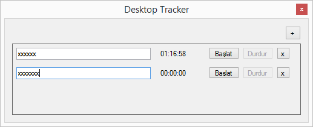

# DesktopTracker

Simply allows you to start and stop tasks.

### Features

- Global Hotkey: Win+Delete
- Task Hotkeys: Ctrl+N = New Task, Ctrl+Number = Start/Pause Task

### Todo List

- Fancy UI
- Toast notification for items
- Pomodoro timer
- Details for items (due date, limit working hours etc.)
- Auto Hide
- Toggling Always on Top
- Localization

See [GitHub Issues](https://github.com/eserozvataf/DesktopTracker/issues).

### Requirements

* .NET Framework and Windows Forms support

## License

Apache 2.0, for further details, please see [LICENSE](LICENSE) file

## Contributing

See [contributors.md](contributors.md)

It is publicly open for any contribution. Bugfixes, new features and extra modules are welcome.

* To contribute to code: Fork the repo, push your changes to your fork, and submit a pull request.
* To report a bug: If something does not work, please report it using GitHub issues.
* To support: 
